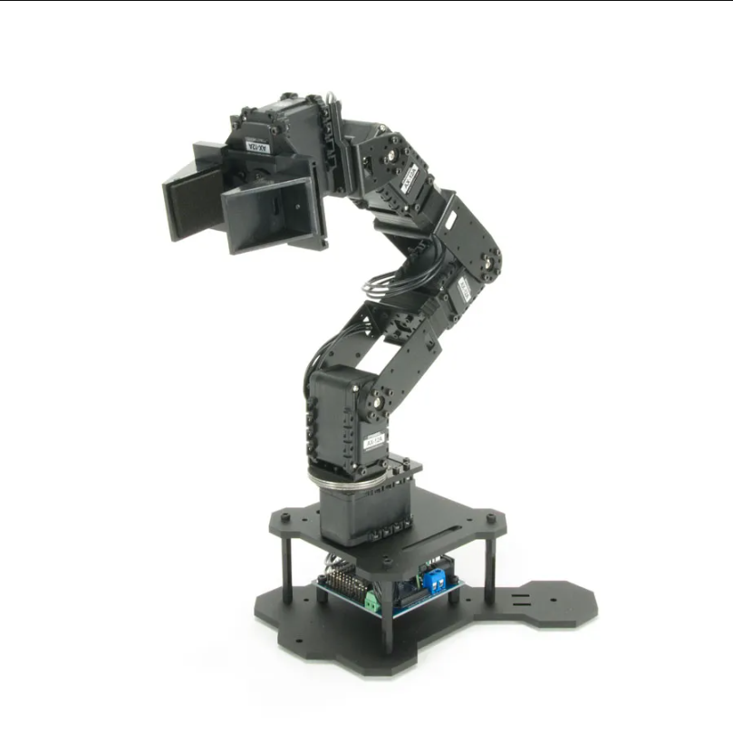
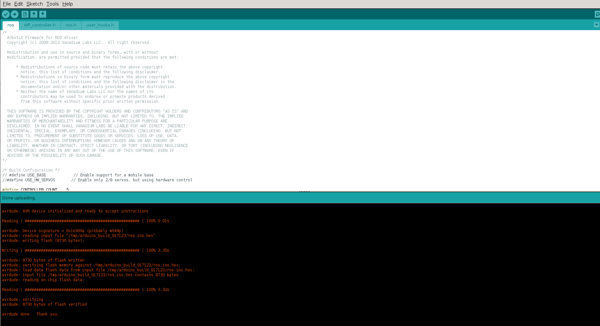

# PhantomX Pincher Arm

This repository includes the ROS1 (and soon the ROS2) codebase to control the
PhantomX pincher robotic arm.

<p align="center">
  
</p>

The project is based on the following upstream projects:

- [ArbotiX support for Arduino IDE 1.8](https://github.com/tician/arbotix/tree/arduino-1.8)
- [arbotix_ros for ROS 1 Noetic](https://github.com/vanadiumlabs/arbotix_ros/tree/noetic-devel)

New modifications has been done to these packages to correctly compile, include
the end effector, and use MoveIt library from ROS1 Noetic.

# Table of Contents

- [PhantomX Pincher Arm](#phantomx-pincher-arm)
  - [Repository layout](#repository-layout)

- [System requirements](#system-requirements)
  - [Hardware](#hardware)
  - [Software](#software)
  - [Safety precautions](#safety-precautions)
  - [Arbotix-M and Arduino IDE](#arbotix-m-and-arduino-ide)
    - [Step 1: Install Arduino IDE 1.8](#step-1-install-arduino-ide-18)
    - [Install the ArbotiX board definition and libraries](#install-the-arbotix-board-definition-and-libraries)
  - [Programming ROS firmware in the robot](#programming-ros-firmware-in-the-robot)

- [ROS1 installation](#ros1-installation)
  - [Installing ROS1 Noetic and MoveIt](#installing-ros1-noetic-and-moveit)
  - [Configure access to the serial port](#configure-access-to-the-serial-port)
  - [Running ROS1 MoveIt node](#running-ros1-moveit-node)
  - [Use MoveIt in RViz](#use-moveit-in-rviz)

- [ROS2 installation](#ros2-installation)

## Repository layout

The relevant directories are expected to have the following structure:

```text
.
├── Arduino board/
│   ├── Arduino/
│   │   ├── hardware/
│   │   └── libraries/
│   ├── arbotix_firmware/
│   │   └── src/ros/ros.ino
│   └── arduino-1.8.3-linux64.zip
├── ROS1/
│   └── src/
│       └── ... ROS packages ...
└── readme_images/
    ├── board_flash.png
    └── pincher_arm.png
```

All commands below assume that the terminal is initially opened in the root of this repository.

# System requirements

## Hardware

- PhantomX Pincher robotic arm;
- ArbotiX-M controller board;
- the correct external power supply for the arm and Dynamixel servos;
- a data-capable USB cable;
- an AMD64 computer with an Intel or AMD processor.

## Software

- Ubuntu 20.04 LTS, 64-bit (either native, either with a Docker image);
- Arduino IDE 1.8.x;
- ROS 1 Noetic;
- MoveIt 1;
- Git and the standard Catkin build tools.

## Safety precautions

> [!WARNING] The arm may move immediately after the controller starts. Keep
> people, cables, and objects outside its workspace. Put the robot in a stable,
> unobstructed position before applying servo power, and be ready to disconnect
> the external power supply.

- Do not power the servos from the computer's USB port.
- Use the voltage and polarity required by the ArbotiX-M board and the installed
  servos.
- Switch off servo power before manually repositioning the arm.
- During the first test, use a large free workspace and conservative motions.
- Do not execute a trajectory if the RViz model does not match the physical
  pose.

## Arbotix-M and Arduino IDE
The Arbotix-M board is an Atmel MCU-based board, such as the Arduino boards.
Therefore, they are compatible with Arduino IDE. The board contains an USB
connector to connect to the PC, and transfer those programs. To use Arduino IDE,
we need to provide it with the required hardware and libraries folders so that
the software will understand how to interact with the Arbotix-M board. Once this
folder provided, we can upload any code to the Atmel MCU to move the servo
motors as we want, in an standalone manner.

In our case, we want to command the robot remotely, using the PC. Thus, we need
to load a program into the Atmel MCU to just wait for messages that will tell it
what to do. In what follows, we will list the instructions to do so.

### Step 1: Install Arduino IDE 1.8
Since the robot is old, we need to have an older version of Ubuntu. In this
case, we will use a Docker system with Ubuntu 20.04.

The Arduino 1.8 installer file is in the folder [Arduino
board](Arduino%20board/), as a ZIP file
[arduino-1.8.3-linux64.zip](Arduino%20board/arduino-1.8.3-linux64.zip).

Uncompress the file, and run the script `install.sh` to install the
software. Then, run the executable file `arduino` in the same folder as the
`install.sh` script.

```bash
cd Arduino\ board;
unzip arduino-1.8.3-linux64.zip;                     ## Uncompress Arduino IDE installer
sudo ./arduino-1.8.3-linux64/arduino-1.8.3/install.sh;    ## Install Arduino IDE
./arduino-1.8.3-linux64/arduino-1.8.3/arduino;       ## Run Arduino IDE
```

Start Arduino IDE once, then close it. This creates the Arduino user directory when it does not already exist.

### Install the ArbotiX board definition and libraries

Copy the folder called `Arduino` in your `$HOME` directory.

```bash
cd Arduino\ board;      ## Go to the Arduino board directory
cp -r Arduino $HOME;    ## Copy the hardware and libraries folders in $HOME
```

The resulting installation should contain ArbotiX-related files under paths such as:

```text
~/Arduino/hardware/
~/Arduino/libraries/
```

Open the Arduino IDE, and in the menu `Tools -> Board`, now you should see
at the bottom the `Arbotix-M` board available. Choose it.

Connect the PhantomX robotic arm robot to your computer, and in the menu
`Tools -> port` of the Arduino IDE you should see a device like
`/dev/ttyUSBX`, where `X` is  a number starting from 0.

To identify the port from a terminal, compare the output before and after
connecting the board with this command:

```bash
ls -l /dev/ttyUSB* 2>/dev/null
```

That's it, your Arduino IDE is installed and configured to program the Atmel
MCU.

## Programming ROS firmware in the robot

Place the arm in a safe position. It is preferable to leave the servo power
switched off while uploading the firmware.

Connect your robot to the computer, and open the Arduino IDE with the
configuration mentioned just above. Now, go to the menu `File -> Open`, and
a file explorer will appear. Navigate up to this repository folder, then
`Arduino Board -> arbotix_firmware -> src -> ros`, and choose the
`ros.ino` file.

Then, to the menu `Sketch -> Upload`, and the Arduino IDE will first compile then
it will upload the software to the Arbotix-M Atmel board. If everything went
normally, you should see a message like this one:

<p align="center">
  
</p>

After a successful upload:

1. close Arduino IDE and its Serial Monitor;
2. disconnect the USB cable;
3. wait a few seconds;
4. reconnect the USB cable;
5. check that the serial device appears again.

The ArbotiX-M board is now running the firmware that receives commands from the
ROS driver over USB.

# ROS1 installation
## Installing ROS1 Noetic and MoveIt

Now, we want to command the robot using ROS1 Noetic. This is the default ROS
version for Ubuntu 20.04. For doing so, first of all, we have to install ROS.
The full instructions are
[here](https://wiki.ros.org/noetic/Installation/Ubuntu.

Briefly, you have to run the following commands:
```bash
sudo sh -c 'echo "deb http://packages.ros.org/ros/ubuntu $(lsb_release -sc) main" > /etc/apt/sources.list.d/ros-latest.list' &&
sudo apt-key adv --keyserver keyserver.ubuntu.com --recv-keys F42ED6FBAB17C654 && \
sudo apt update && \
sudo apt install -y --no-install-recommends curl &&
curl -s https://raw.githubusercontent.com/ros/rosdistro/master/ros.asc | sudo apt-key add - &&
sudo apt update &&
sudo apt install -y --no-install-recommends ros-noetic-desktop-full &&
sudo apt update &&
sudo apt install -y --no-install-recommends \
    python3-rosinstall \
    python3-rosinstall-generator \
    python3-wstool \
    build-essential \
    ros-noetic-moveit \
    python3-rosdep && \
sudo rosdep init && \
rosdep update && \
python3 -m pip install pyserial opencv-python numpy matplotlib
```

This process will take a while, depending on your computer and your internet
connection. Once finished, you need to source the setup file. If you use bash as
default terminal, run:

```bash
echo "source /opt/ros/noetic/setup.bash" >> ~/.bashrc
source ~/.bashrc
```

If your default terminal is zsh, run:
```bash
echo "source /opt/ros/noetic/setup.zsh" >> ~/.zshrc
source ~/.zshrc
```

## 5. Configure access to the serial port

Ubuntu normally assigns `/dev/ttyUSB*` devices to the `dialout` group. Add the
current user to that group:

```bash
sudo usermod -aG dialout "$USER"
```

Log out of the graphical session and log back in, or reboot the computer.
Opening a new terminal alone is not sufficient.

After logging back in, verify the group and device permissions:

```bash
groups
ls -l /dev/ttyUSB* 2>/dev/null
```

The output of `groups` should contain `dialout`. Do not work around permission
problems by launching ROS with `sudo` or by permanently setting the device to
mode `777`.


## Running ROS1 MoveIt node
Once the Arduino firmware is flashed in the PhantomX pincher robot, and ROS1
Noetic is installed, then we can compile and run the MoveIt node, jointly with
RViz. All the required models, URDFs, and code for this module are in the ROS1
folder. We compile with `catkin_make`, and then we launch the `moveit.launch`
program. We assume you are using bash as default terminal. Before starting the
ROS nodes, check that the baudrate and the device path are correct. The default
baudrate is set to 9600, and the default device path is `/dev/ttyUSB0`. If this
configuration changes, update the corresponding parameters in the launch file
located at
`ROS1/src/phantomx_pincher_arm/phantomx_pincher_arm_bringup/launch/arm.launch`.

Finally, use the following instructions to launch the program:

```bash
cd ROS1;
catkin_make;
source ./devel/setup.bash;
roslaunch phantomx_pincher_arm_bringup moveit.launch;
```

This launch file will simultaneously bringup the robot communication node, it
will launch the `robot_description` node, the moveit controller, and
finally, the RViz visualization tool.

NOTE: The USB cable does not power the servo motos. Thus, in order to use
the arm, connect the corresponding power source to the robotic arm.

## Use MoveIt in RViz

After RViz opens:

1. check that the robot model is visible and that its pose matches the physical
   arm;
2. check that the **Fixed Frame** does not report an error;
3. open the **MotionPlanning** panel;
4. select the arm's configured planning group, commonly named `arm`;
5. drag the interactive end-effector marker to a nearby, collision-free target;
6. click **Plan** and inspect the animated trajectory;
7. only if the trajectory is safe, click **Execute**.

Start with small movements. If planning succeeds in RViz but the physical arm
does not move, check the controller state and serial connection before trying
again.

# ROS2 installation
